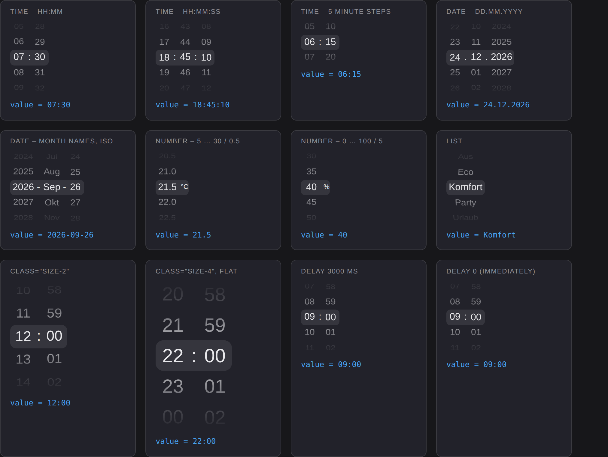

# ftui-picker

Ein Picker im iOS-Stil für **FHEM Tablet UI 3 (FTUI3)**. Werte werden durch
Scrollen nach oben und unten ausgewählt – mit Endlos-Rädern, 3D-Neigung,
Schnappen auf die Mitte und Touch-Schwung wie auf dem iPhone.



Der Picker kann

* **Uhrzeiten** – `hh:mm`, `hh:mm:ss`, beliebige Formate, auch mit 5-Minuten-Schritten
* **Datum** – Tag, Monat, Jahr in beliebiger Reihenfolge, wahlweise mit Monatsnamen
* **Zahlen** – von/bis/Schrittweite, mit Einheit
* **Listen** – frei definierte Einträge (z. B. Betriebsmodi)

Er skaliert vollständig über die FTUI-Klassen `size-x` (`class="size-4"`) und
schreibt den ausgewählten Wert erst nach einer **einstellbaren Verzögerung**
ins Reading, damit beim Durchscrollen nicht jeder Zwischenwert an FHEM geht.

---

## Installation

### Über FHEM update (empfohlen)

Im FHEM-Kommandofeld:

```
update add https://raw.githubusercontent.com/chrisse1/fhem-ftui-components-picker/main/controls_ftuipicker.txt
update
```

`update add` merkt sich die Kontrolldatei in `FHEM/controls.txt`, ab dann wird
der Picker bei jedem `update` mit aktualisiert. Ein Neustart von FHEM ist nicht
nötig – es werden nur Dateien unter `www/` installiert. Im Browser einmal mit
Strg+F5 neu laden, damit die neue Datei nicht aus dem Cache kommt.

Nützliche Varianten:

```
update check                 zeigt, was sich geändert hat, ohne es zu installieren
update list                  zeigt alle eingetragenen Kontrolldateien
update delete https://raw.githubusercontent.com/chrisse1/fhem-ftui-components-picker/main/controls_ftuipicker.txt
```

Einmalig installieren, ohne die Kontrolldatei dauerhaft einzutragen:

```
update all https://raw.githubusercontent.com/chrisse1/fhem-ftui-components-picker/main/controls_ftuipicker.txt
```

Installiert werden:

| Datei | Zweck |
|---|---|
| `www/ftui/components/picker/picker.component.js` | die Komponente |
| `www/ftui/examples/picker.html` | Beispielseite |

### Von Hand

Genauso gut kann man die eine Datei direkt kopieren:

```bash
cd /opt/fhem/www/ftui/components
mkdir -p picker
wget -O picker/picker.component.js \
  https://raw.githubusercontent.com/chrisse1/fhem-ftui-components-picker/main/www/ftui/components/picker/picker.component.js
```

In beiden Fällen ist damit alles erledigt – FTUI lädt die Komponente
automatisch, sobald ein `<ftui-picker>` auf der Seite steht. Es muss nichts
eingebunden oder registriert werden.

## Schnellstart

```html
<!-- Uhrzeit, liest und schreibt das Reading dummy1:time -->
<ftui-picker mode="time" [(value)]="dummy1:time"></ftui-picker>

<!-- Datum -->
<ftui-picker mode="date" [(value)]="Urlaub:start"></ftui-picker>

<!-- Zahl mit Einheit, schreibt per set-Befehl -->
<ftui-picker mode="number" min="5" max="30" step="0.5" unit="°C"
  [value]="Thermostat:desired-temp"
  (value)="set Thermostat desired-temp $value">
</ftui-picker>

<!-- Liste -->
<ftui-picker mode="list" list="Aus,Eco,Komfort,Party,Urlaub"
  [(value)]="Heizung:mode">
</ftui-picker>
```

---

## Betriebsarten (`mode`)

### `mode="time"` – Uhrzeit

Standardformat ist `hh:mm`. Über `format` lässt sich jede Kombination aus
`hh`, `mm` und `ss` mit beliebigen Trennzeichen bauen.

```html
<ftui-picker mode="time" value="07:30"></ftui-picker>
<ftui-picker mode="time" format="hh:mm:ss" value="18:45:10"></ftui-picker>
<ftui-picker mode="time" format="hh Uhr mm" value="20 Uhr 15"></ftui-picker>

<!-- nur 5-Minuten-Schritte: 00, 05, 10 ... -->
<ftui-picker mode="time" minute-step="5" value="06:15"></ftui-picker>
```

Der Wert ist immer zweistellig aufgefüllt, also `07:30`. Beim Lesen ist der
Picker tolerant: `7:30`, `07:30:00` oder `2026-09-26 07:30` werden korrekt
übernommen (es werden die Zahlen in der Reihenfolge des Formats gelesen).

### `mode="date"` – Tag / Monat / Jahr

Standardformat ist `dd.mm.yyyy`. Möglich sind `dd`, `mm`, `yyyy` und `yy`.

```html
<ftui-picker mode="date" value="24.12.2026"></ftui-picker>

<!-- ISO-Format, dadurch ist auch der Wert ISO: 2026-09-26 -->
<ftui-picker mode="date" format="yyyy-mm-dd" value="2026-09-26"></ftui-picker>

<!-- mit Monatsnamen, Jahre auf 2026..2030 begrenzt -->
<ftui-picker mode="date" month-format="short" locale="de-DE"
  min-year="2026" max-year="2030" value="26.09.2026">
</ftui-picker>
```

Das Tages-Rad passt sich automatisch an Monat und Jahr an (28/29/30/31 Tage).
Wird von einem 31-Tage-Monat in den Februar gewechselt, rutscht der Tag auf
den 28. bzw. 29. Der **Wert** enthält immer die Monatszahl – `month-format`
ändert nur die Anzeige.

Ohne `min-year`/`max-year` wird das aktuelle Jahr ±10 angeboten.

### `mode="number"` – Zahlen

```html
<ftui-picker mode="number" min="5" max="30" step="0.5" unit="°C" value="21.5"></ftui-picker>
<ftui-picker mode="number" min="0" max="100" step="5" unit="%" value="40"></ftui-picker>
<ftui-picker mode="number" min="1" max="12" pad="2" value="03"></ftui-picker>
```

Die Nachkommastellen ergeben sich aus `step` (`step="0.5"` → eine
Nachkommastelle) und lassen sich mit `decimals` überschreiben. Ein Wert von
außen wird auf den nächstgelegenen Schritt gerundet (`23.4` → `23.5`).

### `mode="list"` – eigene Einträge

Wie bei `ftui-dropdown`: `list` sind die angezeigten Texte, `vallist`
optional die dazugehörigen Werte.

```html
<ftui-picker mode="list" list="Aus,Eco,Komfort,Party" value="Eco"></ftui-picker>

<ftui-picker mode="list"
  list="Wohnzimmer,Küche,Schlafzimmer"
  vallist="living,kitchen,bedroom"
  [(value)]="Sonos:room">
</ftui-picker>

<!-- Liste aus einem Reading -->
<ftui-picker mode="list" [list]="dummy4:setList" [(value)]="dummy4"></ftui-picker>
```

---

## Verzögertes Schreiben (Delay)

Beim Scrollen soll nicht jeder Zwischenwert an FHEM gehen. Deshalb wird der
ausgewählte Wert erst nach einer einstellbaren Zeit geschrieben – gemessen ab
dem Moment, in dem ein Rad stehen bleibt. Wird innerhalb dieser Zeit weiter
gescrollt, beginnt die Wartezeit von vorn; geschrieben wird nur der zuletzt
ausgewählte Wert.

```html
<!-- Standard: 500 ms -->
<ftui-picker mode="time" [(value)]="dummy1:time"></ftui-picker>

<!-- erst nach 3 Sekunden schreiben -->
<ftui-picker mode="time" debounce="3000" [(value)]="dummy1:time"></ftui-picker>

<!-- "delay" ist ein Alias für "debounce", ebenfalls in Millisekunden -->
<ftui-picker mode="time" delay="2000" [(value)]="dummy1:time"></ftui-picker>

<!-- ohne Verzögerung, sofort schreiben -->
<ftui-picker mode="time" debounce="0" [(value)]="dummy1:time"></ftui-picker>
```

Ab 250 ms zeigt ein dünner Fortschrittsbalken am unteren Rand an, wie lange es
noch bis zum Schreiben dauert. Mit `no-indicator` lässt er sich abschalten.

Während der Wartezeit und während des Scrollens werden Updates aus FHEM
zurückgehalten, damit einem das Rad nicht unter dem Finger wegspringt. Sie
werden danach automatisch nachgeholt.

Per JavaScript kann man die Wartezeit abkürzen oder abbrechen:

```js
document.querySelector('ftui-picker').submitNow();      // sofort schreiben
document.querySelector('ftui-picker').cancelPending();  // verwerfen
```

---

## Größe und Aussehen

Die gesamte Darstellung ist in `em` aufgebaut und richtet sich damit nach der
Schriftgröße des Elements. Jede FTUI-Größenklasse wirkt also direkt:

```html
<ftui-picker class="size--1" mode="time" value="12:00"></ftui-picker>
<ftui-picker class="size-0"  mode="time" value="12:00"></ftui-picker>
<ftui-picker class="size-2"  mode="time" value="12:00"></ftui-picker>
<ftui-picker class="size-4"  mode="time" value="12:00"></ftui-picker>
<ftui-picker class="size-6"  mode="time" value="12:00"></ftui-picker>
```

Die Anzahl der sichtbaren Zeilen steuert `rows` (1 … 15):

```html
<ftui-picker mode="time" rows="3"></ftui-picker>
<ftui-picker mode="time" rows="7"></ftui-picker>
```

### Wenn der Platz knapp ist

Die ausgewählte Zeile sitzt immer in der Mitte des Pickers. Ist der Picker
höher als die Kachel, in der er steckt, schneidet die Kachel ihn unten ab –
und die Auswahl steht dann optisch nicht mehr mittig, sondern am unteren Rand.
Der Picker muss in diesem Fall also niedriger werden.

`rows` nimmt dafür auch gerade und gebrochene Werte an:

```html
<!-- zwei Zeilen hoch: die Auswahl in der Mitte, darüber und darunter
     schaut je eine halbe Zeile hervor -->
<ftui-picker mode="time" rows="2"></ftui-picker>

<!-- nur die ausgewählte Zeile, ohne Nachbarn -->
<ftui-picker mode="time" rows="1"></ftui-picker>

<!-- Zwischenwerte gehen auch -->
<ftui-picker mode="time" rows="2.5"></ftui-picker>
```

Oder man überlässt es dem Picker. Mit `rows="auto"` nimmt er die Höhe, die
ihm sein umgebendes Element lässt, höchstens aber `max-rows` (Standard 5).
Ändert sich die Höhe später, passt er sich an:

```html
<ftui-picker mode="time" rows="auto"></ftui-picker>
<ftui-picker mode="time" rows="auto" max-rows="7"></ftui-picker>
```

Alles Weitere über CSS-Variablen – sie werden von außen vererbt und lassen
sich pro Picker, pro Seite oder im Theme setzen:

| Variable | Bedeutung | Standard |
|---|---|---|
| `--picker-color` | Textfarbe | `var(--text-color)` |
| `--picker-item-height` | Zeilenhöhe | `1.6em` |
| `--picker-wheel-width` | Mindestbreite eines Rades | `1.8em` |
| `--picker-item-padding` | Abstand links/rechts im Rad | `0.25em` |
| `--picker-separator-padding` | Abstand um `:` bzw. `.` | `0.05em` |
| `--picker-highlight-color` | Balken in der Mitte | `rgba(128,128,128,0.2)` |
| `--picker-highlight-radius` | dessen Eckenradius | `0.4em` |
| `--picker-highlight-border` | statt Balken z. B. Linien oben/unten | `none` |
| `--picker-selected-color` | Farbe des ausgewählten Eintrags | geerbt |
| `--picker-font-weight` / `--picker-selected-font-weight` | Schriftstärke | geerbt |
| `--picker-unit-color` / `--picker-unit-size` | Einheit (`unit`) | geerbt / `0.7em` |
| `--picker-pending-color` | Fortschrittsbalken der Verzögerung | `var(--color-base)` |
| `--picker-focus-color` | Fokusrahmen (Tastatur) | `var(--color-base)` |
| `--picker-mask` | Ausblenden an den Rändern, `none` schaltet es ab | Verlauf |

Beispiel – iOS-Optik mit Linien statt Balken:

```html
<ftui-picker mode="time"
  style="--picker-highlight-color: transparent;
         --picker-highlight-border: 1px solid var(--border-color);">
</ftui-picker>
```

Mit `flat` wird die 3D-Neigung abgeschaltet (flache Liste, etwas sparsamer auf
sehr langsamen Tablets):

```html
<ftui-picker mode="time" flat></ftui-picker>
```

---

## Attribute

| Attribut | Werte | Standard | Beschreibung |
|---|---|---|---|
| `value` | Text | – | ausgewählter Wert, Ein- und Ausgabe |
| `mode` | `time`, `date`, `number`, `list` | `time` | Betriebsart |
| `format` | z. B. `hh:mm`, `dd.mm.yyyy` | je Modus | Räder und Trennzeichen |
| `rows` | Zahl 1 … 15 oder `auto` | `5` | sichtbare Zeilen, gerade und gebrochene Werte erlaubt; `auto` passt sich an die verfügbare Höhe an |
| `max-rows` | Zahl 1 … 15 | `5` | Obergrenze für `rows="auto"` |
| `debounce` | ms | `500` | Verzögerung bis zum Schreiben |
| `delay` | ms | – | Alias für `debounce` |
| `no-indicator` | – | aus | Fortschrittsbalken ausblenden |
| `cyclic` | `true`/`false` | `true` | Endlos-Räder für Stunden, Minuten, Sekunden, Tag und Monat |
| `flat` | – | aus | 3D-Neigung abschalten |
| `hour-step` | Zahl | `1` | Schrittweite der Stunden |
| `minute-step` | Zahl | `1` | Schrittweite der Minuten |
| `second-step` | Zahl | `1` | Schrittweite der Sekunden |
| `min-year` / `max-year` | Jahr | aktuelles Jahr ±10 | Bereich des Jahres-Rades |
| `month-format` | `number`, `short`, `long` | `number` | Anzeige der Monate |
| `month-names` | 12 Namen, kommagetrennt | – | eigene Monatsnamen |
| `locale` | z. B. `de-DE` | Browser | Sprache der Monatsnamen |
| `min` / `max` / `step` | Zahl | `0` / `100` / `1` | Bereich bei `mode="number"` |
| `decimals` | Zahl | aus `step` | Nachkommastellen |
| `pad` | Zahl | `0` | Zahlen mit Nullen auffüllen |
| `unit` | Text | – | Einheit rechts neben dem Rad |
| `list` / `vallist` | kommagetrennt | – | Einträge bei `mode="list"` |
| `delimiter` | Zeichen | `,` | Trennzeichen für `list`, `vallist`, `month-names` |
| `width` / `height` / `color` | CSS-Wert | – | Größe und Farbe des Elements |

Dazu die Standard-Attribute jeder FTUI-Komponente: `hidden`, `disabled`,
`readonly`, `margin`, `padding`.

## Ereignisse

| Ereignis | wann |
|---|---|
| `@value-change` | wenn der Wert geschrieben wird, also nach der Verzögerung |
| `@select` | sofort beim Stehenbleiben eines Rades, noch vor dem Schreiben |

```html
<ftui-picker mode="time"
  @select="console.log('ausgewählt: ' + $event.detail)"
  @value-change="console.log('geschrieben: ' + $event.detail)">
</ftui-picker>
```

## Bedienung

* **Touch** – scrollen und schwungvoll wischen wie auf dem iPhone
* **Maus** – Mausrad über dem Rad, oder Klick auf einen Eintrag, der dann in
  die Mitte rückt
* **Tastatur** – Rad mit Tab anspringen, dann `↑` `↓` `Bild↑` `Bild↓` `Pos1` `Ende`

---

## Beispiele und Demo

* `www/ftui/examples/picker.html` – Beispielseite für die FTUI-Installation
  (in `www/ftui/examples/` ablegen und im Browser öffnen)
* `demo/index.html` – läuft ohne FHEM und ohne FTUI:

```bash
python3 -m http.server 8000
# danach http://localhost:8000/demo/ öffnen
```

Die Demo ersetzt die FTUI-Basisklasse über eine Import-Map durch
`demo/ftui-element.stub.js`. In FTUI selbst wird davon nichts gebraucht.

## Kontrolldatei für FHEM update

`controls_ftuipicker.txt` listet jede installierbare Datei mit exakter Größe
und Zeitstempel – FHEM lädt eine Datei erst neu, wenn sich eines von beidem
ändert, und bricht ab, wenn die heruntergeladene Datei nicht exakt die
angegebene Größe hat. Nach jeder Änderung unterhalb von `www/ftui/` muss sie
deshalb neu erzeugt werden:

```bash
./prepare_update.sh
```

Der Zeitstempel unveränderter Dateien bleibt dabei erhalten, gelöschte Dateien
bleiben als `MOV … unused` stehen und verschwinden dadurch auch aus bestehenden
Installationen. Wer möchte, lässt das automatisch vor jedem Commit laufen:

```bash
git config core.hooksPath .githooks
```

Die Datei `CHANGED` zeigt FHEM beim Update als Änderungshinweis an.

## Tests

Die Komponente wird in einem echten Chromium getestet – Werte, verzögertes
Schreiben, Endlos-Räder, Schalttage, Skalierung und 3D-Darstellung:

```bash
npm install playwright
npx playwright install chromium
node test/picker.test.mjs
```

## Browser

Chrome/Chromium und Edge ab 69, Firefox ab 69, Safari und iOS ab 13.1 sowie
die Android-WebView aktueller Tablets. Verwendet werden Custom Elements,
Shadow DOM, CSS Scroll Snap und `ResizeObserver` – dieselbe Basis, auf der
auch FTUI 3 aufbaut.

## Lizenz

MIT – siehe [LICENSE](LICENSE).
